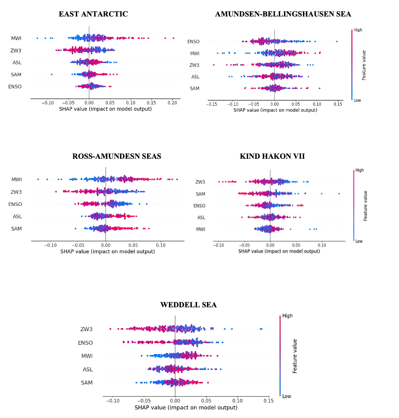

# AOS C204: Introduction to Machine Learning for Physical Sciences 
# ## <p style="text-align:center;">Final Project</p>

I applied machine learning techniques to investigate relationships between Antarctic Sea-ice Thickness and various Southern Hemispheric Atmospheric Indices. 

Below is my report:

***

## <p style="text-align:center;">Title</p>

Understanding relationships between Antarctic sea-ice thickness and the southern hemispheric atmospheric circulations


## Introduction 

Sea-ice distribution in Antarctica is subject to diverse atmospheric and oceanic processes, contributing to non-uniform expansion across the region. Regional disparities are evident, with the Ross Sea experiencing positive (expanding) sea-ice anomalies, while the Amundsen-Bellingshausen Sea witnesses negative (retreating) anomalies (Lefebvre & Goosse, 2008; Matear et al., 2015; Raphael et al., 2016; Zwally et al., 2002). The causative factors for such patterns remain unclear, with proposed influences including atmospheric temperature and wind stress changes (Lefebvre & Goosse, 2005, 2008; Liu et al., 2004) and atmospheric feedback mechanisms (Stammerjohn et al., 2012; Stammerjohn et al., 2008).

This study focuses on Southern Hemisphere atmospheric circulation patterns and their role in explaining interannual variability in Southern Ocean sea-ice trends, with a specific emphasis on Sea-Ice Thickness (SIT). The project aims to elucidate the relationships between Antarctic SIT and five primary large-scale atmospheric circulation indices in the Southern Hemisphere: Southern Annular Mode (SAM), Amundsen Sea Low (ASL), El-Nino Southern Oscillation (ENSO), Meridional Wind Index (MWI), and Zonal Wave-3 Index (ZW3). While these indices are recognized as primary drivers of Antarctic sea-ice changes, their influence varies regionally, and no singular mode has been identified as the predominant factor governing total sea-ice changes in Antarctica. In addition to regional heterogeneity, seasonal variabilities in sea-ice are influenced by atmospheric models. Given the non-linear relationships between sea-ice and atmospheric variables, this study employs supervised Random Forest Regression, a machine learning algorithm, to comprehend and predict these intricate relationships. The objectives of this study include:

I. **Understanding the Significance of Climatic Modes:**
  - Identifying the primary dictating factor for sea-ice distribution in each region.
  - Assessing the magnitude and direction of the impact.

II. **Assessing effectiveness of selected Machine Learning Algorithm:** 
  - Evaluating the efficacy of supervised machine learning algorithm, specifically Random Forest Regression, in capturing spatio-temporal relationships.
  - Investigating the seasonal variations in the performance of regional specific-trained Random Forest Regression models.


## Data

My project will utilize gridded NetCDF datasets which are 3-D datasets (longitude, latitude, time) for various sea-ice and atmospheric variables. These will be derived from the historical experiment of the CMIP6’s coupled climate model (i.e. CESM2) for the time-period of 1979-2014. The dataset can be accessed and downloaded from the ESGF website via following: https://esgf-node.llnl.gov/search/cmip6/. Various climatic indices have been calculated using different atmospheric variables obtained from the historical experiment of CESM2 couple climate model. The details can be found in Table 1. 

<p align="center">
  
</p>

## Methodlogy

### Data Pre-processing in Python:

All variables underwent pre-processing in Python using the “xarray” library. Original datasets, in NetCDF 3-D format, were transformed into time series (Fig. 1a) following methodologies detailed in studies outlined in Table 1. The SIT dataset utilized here represents a time series derived from area-averaging calculations of the spatial dataset. For regional analysis, the circum-Antarctic (Southern Ocean) region was partitioned into five major zones: Amundsen-Bellingshausen Seas (ABS), Ross-Amundsen Seas (RAM), East Antarctic, King Hakon VII, and Weddell Sea (Fig. 1b). Additionally, the time series was segregated into two primary sea-ice seasons: Advance (April-August) and Retreat (October-February). This segmentation aligns with the approach outlined in the study by Raphael & Hobbs, 2014.  

<p align="center">
  
</p>


*Figure 1: a) Time series for the five selected atmospheric circulation indices in the Southern Hemisphere; b) Selected Antarctic regions based on Raphael and Hobbs, 2014.*

### Supervised Machine Learning Approach:

This project employs a supervised Machine Learning Algorithm, specifically the Random Forest Regression Algorithm. Previous studies have established that the trend in daily total Antarctic sea-ice over time is strongly nonlinear and that the linear estimates are weak and dependent on a positive trend that began in 2011 and ended in 2016 (Handcock & Raphael, 2020). This suggests that the relationship between sea ice extent and other climatic variables could also be nonlinear. In a nonlinear relationship, the changes in one variable are not proportional to changes in the other, and the relationship may exhibit complex patterns or behaviors. If linear estimates are weak and dependent on specific trends within a certain timeframe, it implies that a simple linear model may not capture the true nature of the relationship. Nonlinear relationships could involve threshold effects, interactions, or other complexities that linear models might not adequately represent. Therefore, in this study I have employed the use of sophisticated nonlinear models (i.e. a supervised regression technique of Random Forest Regression Algorithm) to better understand the dynamics between Antarctic sea-ice and other climatic variables. The analysis involves identifying various atmospheric indices as “predictors” (features), with the Antarctic SIT as the predicted (target) variable. This process is executed for each region and across two distinct sea-ice seasons.


Prior studies established these selected indices as significant drivers of Antarctic sea-ice changes. To statistically validate their significance, covariance (Fig.2) among the indices was calculated. This analysis justifies their selection based on correlations, where higher correlations imply similar impact and covariability, thereby reducing the distinct impact of individual predictors.
<p align="center">
  
</p>

*Figure 2: Covariance matrix showing correlations between different atmospheric circulation-based indices.*

The preference is for features that are as “mutually exclusive” as possible. Fig.2 illustrates that most of the chosen predictors exhibit minimal correlations among themselves. An exception is observed for the SAM and ASL, with the highest correlation value recorded at -0.56. However, this correlation, although notable, is not significantly high to compromise its relevance as the crucial predictors.


## Modeling

Following python packages were used in constructing a Machine Learning Model:


```python
#For Random Forest Regression:

from sklearn.model_selection import train_test_split
from sklearn.ensemble import RandomForestRegressor
from sklearn.tree import export_graphviz
import shap
from sklearn.pipeline import Pipeline

from sklearn.pipeline import make_pipeline
from sklearn.metrics import mean_squared_error
from sklearn.metrics import r2_score
from sklearn.linear_model import Ridge
from sklearn.preprocessing import StandardScaler
```

I constructed a pipeline with feature scaling and Random Forest Regressor as follows: 


```python
# Split the data into train and test sets for SIT:
train_features, test_features, train_labels, test_labels = train_test_split(features, labels, 
                                                                                test_size = 0.25, 
                                                                                random_state = 42)
# Create a pipeline with StandardScaler and RandomForestRegressor
rf_pipeline = Pipeline([('scaler', StandardScaler()),
        ('rf', RandomForestRegressor(n_estimators=1000, random_state=42))]) 

# Train the model on training data
rf_pipeline.fit(train_features, train_labels)
    
# Use the forest's predict method on the test data
predictions = rf_pipeline.predict(test_features)
```

Thereafter, I calculated feature importance which gave an estimate of how important a particular feature is in determining the target variable i.e. SIT. These feature importance values are then plotted as bar plots for every region and two distinct seasons:


```python
# Access the RandomForestRegressor model inside the pipeline
rf_model = rf_pipeline.named_steps['rf']

# Get numerical feature importances
importances = list(rf_model.feature_importances_)

# List of tuples with variable and importance
feature_importances = [(feature, round(importance, 3)) for feature, importance in zip(feature_list, importances)]

# Sort the feature importances by most important first
feature_importances = sorted(feature_importances, key = lambda x: x[1], reverse = True)

# Print out the feature and importances 
[print('Variable: {:20} Importance: {}'.format(*pair)) for pair in feature_importances];
```

This study also employs the use of SHAP (SHapley Additive exPlanations) plots. SHAP values are a way to explain the output of any machine learning model. It uses a game theoretic approach that measures each feature’s contribution to the final outcome. In machine learning, each feature is assigned an importance value representing its contribution to the model’s output (as seen above). SHAP values show how each feature affects each final prediction, the significance of each feature compared to others, and the model’s reliance on the interaction between features. Similarly, SHAP plots were also produced for every region and the seasons:


```python
# Create an explainer object
explainer = shap.Explainer(rf_model)

# Calculate SHAP values for the test set
shap_values = explainer.shap_values(test_features)

# Plot individual SHAP value plots
shap.summary_plot(shap_values, test_features, feature_names=feature_list,show=False)    
ax.set_title("SHAP Value",fontsize=12,fontweight="bold")
ax.set_xlabel("Impact on model output", fontsize=10,  fontweight='bold')

plt.show()
```

In the end, I have compared the regional Random Forest Regression Models for every season by using the Regression Error Characteristics (REC) Curves to assess how the models have performed in every region:

```python
# REC curve
def rec(m, n, tol):
    if not type(m) == 'numpy.ndarray':
        m = np.array(m) #change m to a np array
    if not type(n) == 'numpy.ndarray':
        n = np.array(n) #change n to a np array

    l = m.size
    percent = 0
    for i in range(l):
        if np.abs(10**m[i]-10**n[i])<=tol:
            percent+=1
    return 100*(percent/l)
```


## Results

<p align="center">
  
</p>

*Figure 3:  Plot showing the feature importance for all the 5 regions (x-axis) and their corresponding importance in the two seasons.*

<p align="center">
  
</p>

*Figure 4:  SHAP Plots showing the magnitude and the intensity of the impact of the features on the predicted target value i.e. SIT for the 5 regions for Advance Season.*

<p align="center">
  
</p>

*Figure 5:  SHAP Plots showing the magnitude and the intensity of the impact of the features on the predicted target value i.e. SIT for the 5 regions for Retreat Season.*

<p align="center">
  
</p>

*Figure 6:  REC Curves for the regional Random Forest Regression Models for two distinct sea-ice seasons.*


## Discussion and Conclusions

**I.	Feature Importance Analysis highlighted and reaffirmed the regional heterogeneity around the Antarctic in terms of distinct atmospheric circulation-based Indices dictating the regional SIT distributions.**

Figure 3 highlights the distinct nature of sea-ice distribution in each Antarctic region, primarily attributed to unique influencing factors that affect the distribution disparately. Each region exhibits a diverse set of dominant climatic indices that mold SIT during specific seasons. For instance, in the Advance season, Zonal Wave-3 (ZW3) emerges as a prominent climatic variability mode in most regions. However, during the Retreat season, the Amundsen Sea Low (ASL) consistently takes precedence as the foremost climate mode across all regions, exhibiting a substantial magnitude difference whereas, ZW3 remains a dormant mode of climatic variability. This substantiates the hypothesis that despite shared atmospheric, oceanic characteristics, and geographical proximity, Antarctic regions experience distinct impacts from specific climate indices, contributing to the observed regional heterogeneity in Southern Ocean sea-ice. Consequently, this analysis aids in discerning the predominant climate mode in each region.
SHAP Plots (Fig.4 and 5) build upon the results from the Fig.3 by assessing the direction and magnitude of the relationships between the climatic indices and SIT across regions and seasons. For the retreat season, Fig.3 illustrates the predominant influence of the ASL on SIT across all Antarctic regions. This information is further supported by SHAP plots in Fig.4, depicting the magnitude and direction of the ASL’s influence. The plots reveal a consistent strong positive relationship between ASL and SIT across all regions. Specifically, higher magnitudes of ASL (represented by red dots) correspond to a positive impact on SIT (reflected via the positive x-axis). In essence, a stronger ASL tends to increase SIT in each region, while a weaker ASL is associated with a decrease in SIT.

**II.	The constructed Regional Random Forest Regression Model performs better for the Ross-Amundsen Seas during the Advance season and the East Antarctic Region during the Retreat season. Overall, the seasonal performance of regional models is better during the Advance Season compared to the Retreat Season.**

My findings demonstrate the effectiveness of the Random Forest Regression Model in establishing relationships between diverse features (in my case, Climate Indices in Southern Hemisphere), whether inclusive or exclusive, and the target variable (i.e. SIT). The model proves to be a valuable tool for identifying key drivers of sea ice changes through its feature importance function and facilitates the assessment of the nature of relationships using SHAP Plots. However, it is noteworthy that the model’s performance exhibits significant variations depending on the season and geographical regions. 

Several factors contribute to these results:

1. As highlighted in the text and illustrated in figures 3-5, climate indices exhibit heterogeneity in their influence on sea ice thickness, varying with season and region. This diversity in the physical reasons leads to different model performances.

2. The complex and non-linear relationships that these indices share with sea ice thickness might pose challenges for a straightforward Random Forest Regression model to comprehend and establish.

3. Additionally, the covariability of different features can appear distinct across regions and vary seasonally, causing models to perform well in some instances and poorly in others.


In conclusion, the Random Forest Regression Model indicates that certain regions and seasons present more challenges for modeling than others.


## References
[1] ChatGPT

[2] Handcock, M. S., & Raphael, M. N. (2020). Modeling the annual cycle of daily Antarctic sea ice extent. The Cryosphere, 14(7), 2159–2172. https://doi.org/10.5194/tc-14-2159-2020

[3] Hobbs, W., Massom, R., Stammerjohn, S., Reid, P., Williams, G., & Meier, W. (2016). A review of recent changes in Southern Ocean sea ice, their drivers and forcings. Global and Planetary Change, 143. https://doi.org/10.1016/j.gloplacha.2016.06.008

[4] Hosking, J. S., Orr, A., Marshall, G. J., Turner, J., & Phillips, T. (2013). The Influence of the Amundsen–Bellingshausen Seas Low on the Climate of West Antarctica and Its Representation in Coupled Climate Model Simulations. Journal of Climate, 26(17), 6633–6648. https://doi.org/10.1175/JCLI-D-12-00813.1

[5] Kwok, R., & Comiso, J. C. (2002). Southern Ocean Climate and Sea Ice Anomalies Associated with the Southern Oscillation. Journal of Climate, 15(5), 487–501. https://doi.org/10.1175/1520-0442(2002)015<0487:SOCASI>2.0.CO;2

[6] Raphael, M. N. (2004). A zonal wave 3 index for the Southern Hemisphere: ZONAL WAVE 3 INDEX. Geophysical Research Letters, 31(23). https://doi.org/10.1029/2004GL020365

[7] Raphael, M. N., & Hobbs, W. (2014). The influence of the large-scale atmospheric circulation on Antarctic sea ice during ice advance and retreat seasons. Geophysical Research Letters, 41(14), 5037–5045. https://doi.org/10.1002/2014GL060365

[8] Thompson, D. W. J., & Wallace, J. M. (2000). Annular Modes in the Extratropical Circulation. Part I: Month-to-Month Variability. Journal of Climate, 13(5), 1000–1016. https://doi.org/10.1175/1520-0442(2000)013<1000:AMITEC>2.0.CO;2


[back](./)

